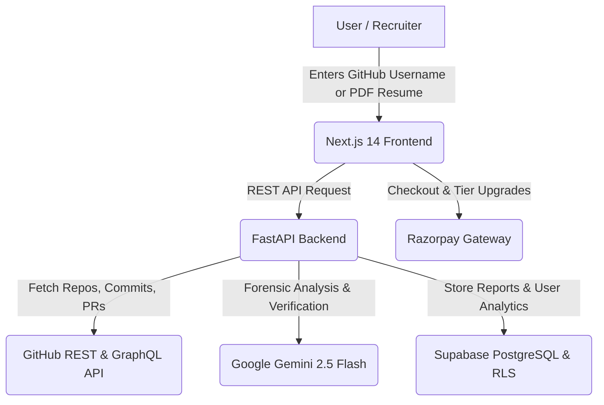

<div align="center">

# ⚡ DevXray AI
### The #1 GitHub Profile Analyzer & AI Resume Checker
**Forensic-Grade Developer Intelligence, Code DNA Analysis & ATS Resume Verification**

[](https://dev-xray.vercel.app)
[](https://nextjs.org)
[](https://fastapi.tiangolo.com)
[](https://ai.google.dev)
[](https://supabase.com)
[](LICENSE)

<br />

**[🌐 Launch Live Web App](https://dev-xray.vercel.app)** • **[📖 View Sample Report](https://dev-xray.vercel.app/report/torvalds)** • **[🚀 Quickstart](#-quickstart--local-setup)** • **[💡 Key Features](#-key-features)**

<br />

```
   ____             _  __                  ___    ____
  / __ \___ _   __ | |/ /_________ ___  _ /   |  /  _/
 / / / / _ \ | / / |   // ___/ __ `/ / / // /| |  / /  
/ /_/ /  __/ |/ / /   |/ /  / /_/ / /_/ // ___ |_/ /   
/_____/\___/|___//_/|_/_/   \__,_/\__, //_/  |_/___/   
                                 /____/                
```

> **Analyze GitHub profiles and verify resumes in 60 seconds.** No guesswork. No recruiter bias. Just pure engineering signal.

</div>

---

## 📌 What is DevXray AI?

**DevXray AI** is a full-stack, forensic-grade **GitHub Profile Analyzer** and **AI Resume Checker** engineered for engineering managers, tech recruiters, and developers who care about code authenticity.

Traditional hiring relies on polished resumes and vanity GitHub stats (stars, follower counts, green commit squares from cron jobs). **DevXray looks inside the code.** It parses hundreds of repositories, analyzes commit structures, detects AI-generated boilerplate (ChatGPT / Copilot), cross-references resume bullet points against actual git commits, and generates a unified **Developer Trust Score**.

---

## 🚀 Key Features

### 1. 🔍 Deep GitHub Profile Forensics
- **LOC-Weighted Language Profiling**: Measures actual code written, eliminating inflated stats from imported dependencies or library files.
- **Commit Authenticity & Cadence**: Detects fake commit bursts, bulk scripted commits, and tutorial clone farms.
- **Repository Architecture Inspection**: Evaluates modularity, testing presence, documentation, and maintainability across public repositories.

### 2. 🤖 AI-Generated Code Detection (12-Pattern Scanner)
- Flags AI-generated code from models like ChatGPT, Claude, and GitHub Copilot.
- Identifies signature AI comments (`// Here's the complete implementation`, boilerplate docstrings, hallucinated imports).
- Calculates an **AI Contribution Ratio** to distinguish authentic human problem solving from copy-pasted prompts.

### 3. 📄 AI Resume Analyzer & ATS Score Matcher
- **PDF Resume Ingestion**: Automatically extracts technical skills, project claims, work history, and education.
- **Claim Verification Engine**: Cross-references claims (e.g., *"Built microservices handling 50k QPS in Go"*) against actual GitHub commits and code complexity.
- **ATS Compatibility & Job Matching**: Scores candidate resumes against target job descriptions and highlights missing technical competencies.

### 4. 🎯 Developer Trust Score & Competency Radar
- **0–100 Trust Score**: A composite rating based on code originality, commit history, architectural maturity, and diversity of language mastery.
- **Multi-Dimensional Radar Chart**: Visualizes proficiency across Backend, Frontend, DevOps, System Architecture, Code Quality, and Testing.

### 5. 📋 Production-Ready Recruiter & Hiring Reports
- Instant, shareable report URLs (`/report/[username]`).
- Tailored **AI Technical Interview Questions** generated directly from the candidate’s weakest points and unique code anomalies.
- PDF and JSON report export for Applicant Tracking Systems (ATS).

---

## 📊 DevXray vs. Traditional Tools

| Feature | Traditional ATS | GitHub Profile (Default) | **DevXray AI** |
| :--- | :---: | :---: | :---: |
| **Commit Authenticity Analysis** | ❌ None | ⚠️ Vanity Squares | ✅ **Deep Forensic Inspection** |
| **AI Code Detection (Copilot/GPT)** | ❌ None | ❌ None | ✅ **12-Pattern AI Scanner** |
| **Resume Claim Cross-Referencing** | ⚠️ Keyword Match | ❌ None | ✅ **Verified Against Git Commits** |
| **LOC-Weighted Language Depth** | ❌ None | ⚠️ Repo Byte Count | ✅ **Filtered for Authored Code** |
| **Developer Trust Score (0-100)** | ❌ None | ❌ None | ✅ **Objective Multi-Metric Score** |
| **AI Technical Interview Prep** | ❌ Generic | ❌ None | ✅ **Customized to Real Weaknesses** |

---

## 🛠️ Architecture & Tech Stack



### **Frontend**
- **Framework**: [Next.js 14](https://nextjs.org/) (App Router, Server Components)
- **Language**: TypeScript
- **Styling**: Tailwind CSS, Syne + Space Grotesk typography, Glassmorphism design system
- **Motion & UI**: Framer Motion, Lucide Icons, Canvas Constellation Particles
- **Deployment**: Vercel (Global Edge Network)

### **Backend**
- **Framework**: [FastAPI](https://fastapi.tiangolo.com/) (Python 3.11)
- **AI Engine**: [Google Gemini 2.5 Flash](https://ai.google.dev/)
- **Data Ingestion**: PyGithub, PDF Plumber, BeautifulSoup4, Requests
- **Validation**: Pydantic v2
- **Deployment**: Render / Docker container

### **Database & Authentication**
- **Provider**: [Supabase](https://supabase.com/) (PostgreSQL with Row Level Security)
- **Auth**: Google OAuth & Email Magic Link
- **Storage**: Supabase Storage for resume processing


## 📄 License

Distributed under the **MIT License**. See `LICENSE` for more information.

<div align="center">
  <sub>Engineered with precision by the <a href="https://dev-xray.vercel.app">DevXray AI Team</a>.</sub>
</div>
